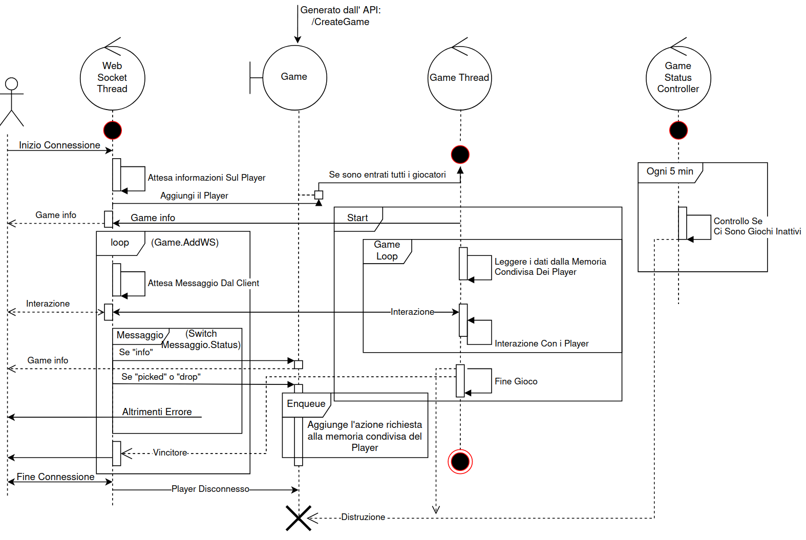
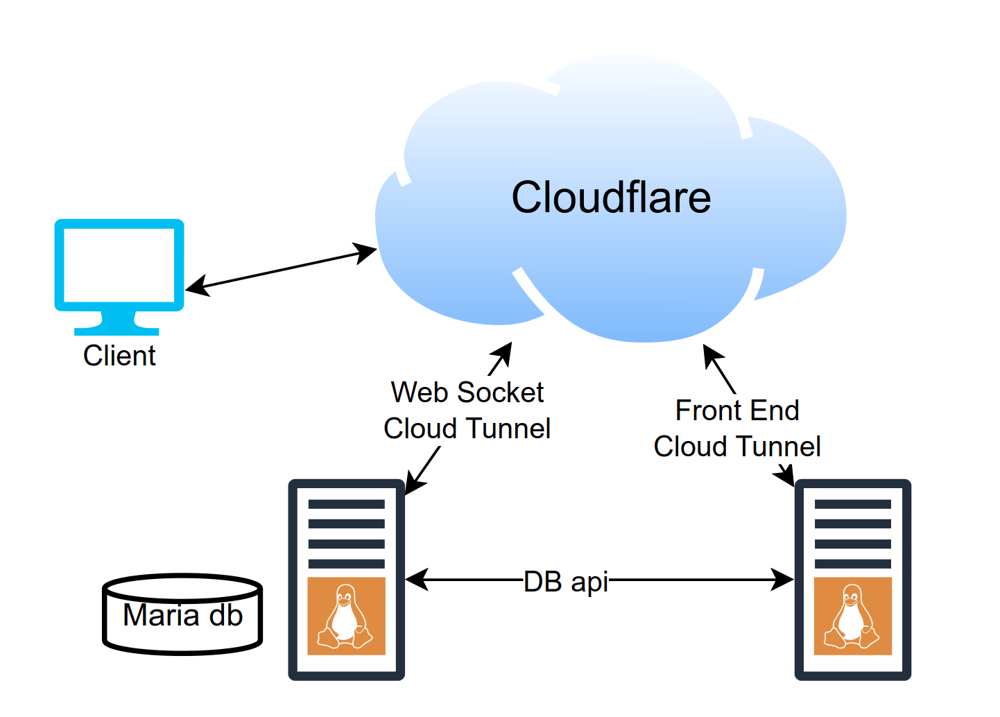

### Threads Diagram



In this architecture, there are N threads at play depending on the situation, but they can be classified into 3 types:

##### Websocket Controller Thread:
  - There is a single thread called "Websocket Controller" responsible for handling incoming communications from the client.
  - Despite being a single physical thread, the system is capable of handling asynchronous communications with N different websockets simultaneously.
  - In other words, while there is only one physical thread named "Websocket Controller," it can independently handle and respond to more than one WebSocket connection simultaneously. This allows the system to operate efficiently and scale, managing communications to and from N WebSocket clients asynchronously, without requiring a direct match between the number of physical threads and the number of WebSocket connections.

##### Game Threads:
  - The architecture includes a set of threads called "Game threads," the number of which is determined by the number of games currently in progress.
  - These threads are responsible for managing game logic and synchronization between WebSocket connections and players using dedicated message queues.
  - The quantity of threads dedicated to games varies based on the number of active games at a given moment.
  - Each thread ensures the consistency of the game and communication between players through the use of message queues, ensuring that player actions and responses are handled correctly and synchronized within the context of each game.
  - This approach provides efficient management of multiple games and a clear separation between different game instances, contributing to maintaining the integrity and organization of the system.

##### Game Status Controller Thread:
  - The "Game Status Controller" is a dedicated thread for monitoring games that have been generated but not utilized.
  - This thread is programmed to perform checks on these games every 5 minutes, identifying and managing games that have been created but remain inactive or unused.
  - Its primary function is to free up unnecessary resources and ensure efficient game management, contributing to keeping the system clean and optimized over time.

The game is generated through a POST-type API, `/CreateGame`, where the creation information is passed, and it returns the game ID. The client then connects to the WebSocket using a handshake at the path `/ws/<game id>`. Cloudflare provides a proxy for the websockets to hide the server's IP address.

### Architecture



In this architecture, the client is separated from the server through the use of Cloudflare as a proxy server. This choice brings several benefits in terms of security:

- Internal exploit management: Cloudflare can detect and mitigate various types of exploits and attacks directly on its infrastructure. This means that many threats are addressed before they reach the underlying server, thus protecting the server's data and resources from potential vulnerabilities.

- Interposition between server and client: The server does not connect directly to the client; instead, it connects to an instance hosted on a Cloudflare server. This intermediary helps alleviate repeated requests from clients, providing an advantage in terms of performance optimization.

- DDoS attack mitigation: Cloudflare is renowned for its ability to handle Distributed Denial of Service (DDoS) attacks. Thanks to its extensive network of servers distributed globally, it can filter malicious traffic and shield the underlying server from overloads and disruptions caused by DDoS attacks.

### Build

```sh
dotnet build
```

### Usage
The ports used by the server can be viewed in `./Properties/launchSettings.json`, With different types of runtime:
- **Production**: the default runtime, run by the  server (with the script `./start-pr.sh`);
  - Use the port: `2053`, from the domain: `http://api.ittsrewritten.com` (changeable)
- **http**: for test
- **https**: for test


